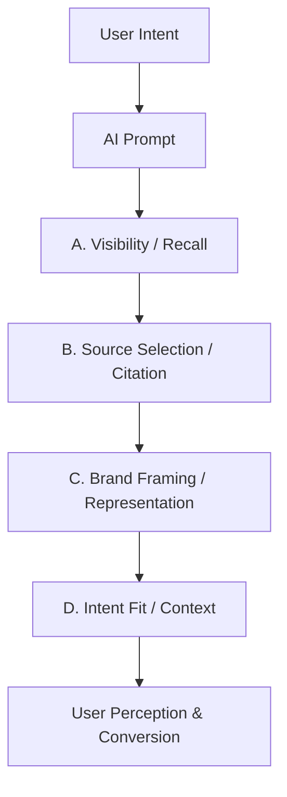

# GEO Measurement Framework

## 🎯 What GEO Measures
**GEO (Generative Engine Optimization)** measures how AI systems **recall, select, frame, and recommend** brands — and how those mechanisms translate into exposure, trust, and conversion.

It answers 3 core questions:
1.  **Exposure**: Does the AI see you?
2.  **Representation**: Does the AI describe you correctly?
3.  **Authority**: Why does the AI choose you?

---

## 📐 The GEO Funnel (Attribution Logic)
GEO is not a single score, but a **causal chain** (Attribution Funnel) that explains the "Why" behind AI visibility.

### Key Insight
> **Without Visibility**, there is no exposure.
> **Without Citation**, exposure is not explainable or authoritative.
> **Without Representation**, exposure does not convert.

---

## 📊 The Metric Matrix
We measure 4 specific dimensions that cannot replace each other.

| Dimension | Core Question | What It Explains | Key Metrics |
| :--- | :--- | :--- | :--- |
| **A. Visibility** | Does AI recall you at all? | **Brand Awareness** | Mention Rate, Avg Rank |
| **B. Citation** | Why does AI trust you? | **Authority & Headroom** | Citation Rate, Source Type |
| **C. Representation** | How does AI describe you? | **Conversion Framing** | Description Accuracy, Sentiment |
| **D. Intent Coverage** | In which contexts are you recalled? | **Demand Fit** | Intent Coverage Rate |

---

## 🏆 Scoring Model
The **Composite GEO Score (0-100)** is used for **benchmarking**, while the dimension scores are for **diagnosis**.

**Formula (MVP):**
$$ \text{GEO Score} = 0.35 \times \text{Visibility} + 0.25 \times \text{Citation} + 0.25 \times \text{Representation} + 0.15 \times \text{Intent} $$

---

## 🚀 Optimization Mapping (Snapshot)
| If you lack... | You need to optimize... |
| :--- | :--- |
| **Visibility** | **Category Definitions**: Be the "Best [Category]" answer. |
| **Citation** | **Factual Density**: Provide citable facts, stats, and "About" pages. |
| **Representation** | **Brand Messaging**: Clear, non-conflicting value propositions. |
| **Intent** | **Contextual Content**: Pages targeting "Best for X", "Cheap Y". |

*See [PLAYBOOK.md](./PLAYBOOK.md) for full optimization details.*
